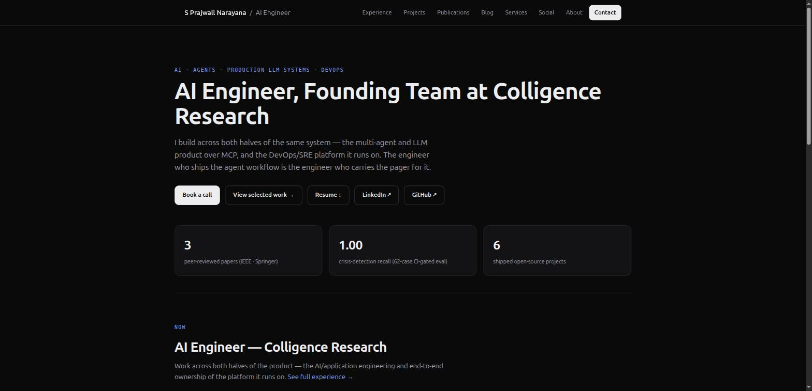
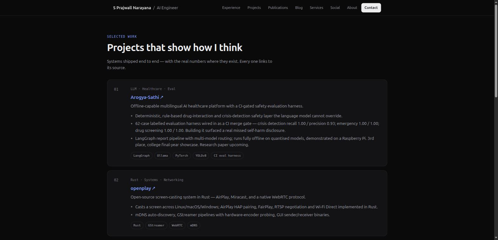

# Portfolio — S Prajwall Narayana

Personal site for **S Prajwall Narayana**, AI Engineer. Nine statically prerendered pages — Home, Experience, Projects, Publications, Blog, Services, Social, About, Contact — built on Next.js 16 App Router with no CSS framework and no client-side JavaScript.



## The one design decision worth knowing

**All copy lives in [`src/lib/content.ts`](src/lib/content.ts).** Every page is a pure server component that imports an array and maps over it. There is no CMS, no MDX, no database.

To change anything on this site — a job title, a project bullet, a publication, a stat — edit that one file. Nothing else needs touching.

That file also carries a rule, stated at the top and enforced by hand:

> No fabricated metrics: every number here is one the CV/evidence file already backs.

The three homepage stats are derived from array lengths where possible, so they cannot drift from the content they summarise.

## Screens

| | |
|---|---|
| **Projects** — selected work, each entry linking to its source |  |

### Social card

Generated at build time by [`src/app/opengraph-image.tsx`](src/app/opengraph-image.tsx) from `content.ts`, so it can never disagree with the site:


## Run it

Requires Node 20+.

```bash
npm install
npm run dev        # http://localhost:3000
```

```bash
npm run build      # static prerender of all 14 routes
npm run start      # serve the production build
npm run lint
```

## Architecture

```
src/
├── app/
│   ├── layout.tsx           root metadata, <Nav>, <Footer>
│   ├── page.tsx             home
│   ├── <section>/page.tsx   one folder per page, all server components
│   ├── blog/[slug]/page.tsx published posts only (see below)
│   ├── opengraph-image.tsx  social card, generated from content.ts
│   ├── sitemap.ts           routes + published posts
│   ├── robots.ts
│   ├── icon.svg             SP monogram, themed to the site palette
│   └── globals.css          ~110 lines, CSS custom properties, no framework
├── components/              Nav, Footer
└── lib/content.ts           ← every word on the site
```

Routing is filesystem-based; adding a page means adding a folder and a line to `links` in [`src/components/Nav.tsx`](src/components/Nav.tsx) and to `routes` in [`src/app/sitemap.ts`](src/app/sitemap.ts).

## Blog publishing model

A post is **published** only when it has a non-empty `body` (an array of paragraphs). Posts without one:

- are listed on `/blog` under **Planned**, greyed out and **not linked**
- get **no generated page** — the slug 404s
- stay **out of the sitemap**

This exists because the site previously advertised three posts with real headlines whose pages all rendered *"Draft — this is where the full post goes. Write it in src/lib/content.ts…"* in production. A real title that dead-ends in build instructions reads worse than no blog at all.

To publish, add a `body` to the post in `content.ts`:

```ts
{
  slug: "what-oomkilled-really-means",
  title: "What OOMKilled Actually Means",
  date: "2026-08-11",
  tag: "systems",
  excerpt: "…",
  body: [
    "First paragraph.",
    "Second paragraph.",
  ],
}
```

## Deployment

Targets Vercel. `metadataBase`, the sitemap and `robots.txt` all read the canonical URL from `profile.portfolio` in `content.ts` — set that before deploying to a new domain, and the rest follows.

> **Note:** `profile.portfolio` currently points at `sprajwallnarayana.vercel.app`, which is presently served by a *different* codebase (a hand-rolled static HTML site with region routing). Decide which repo owns that domain before deploying this one to it.

## Stack

Next.js 16.3.0 (App Router, Turbopack) · React 19 · TypeScript strict · plain CSS · zero runtime dependencies beyond `next` and `react`.
